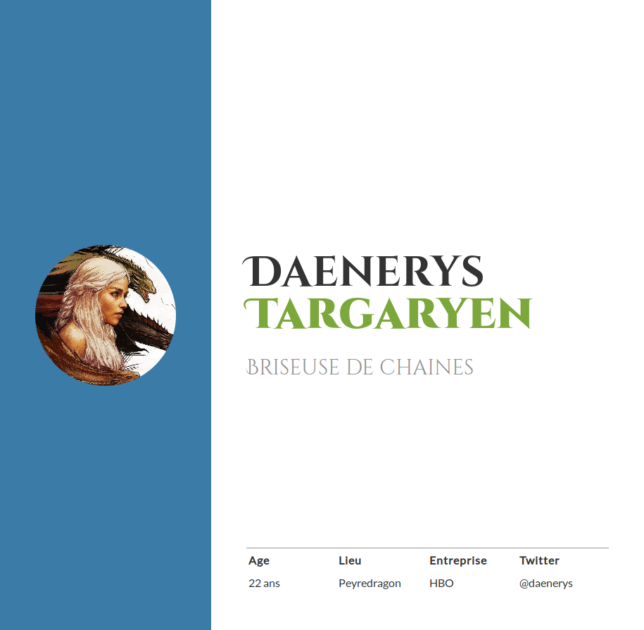
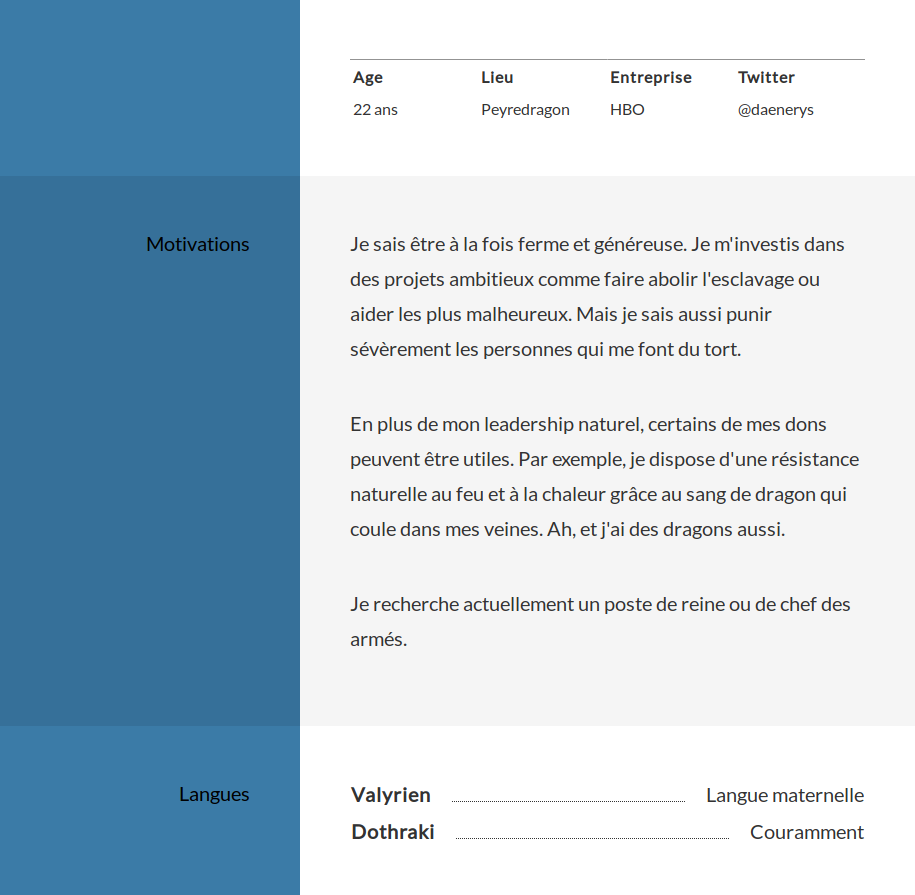
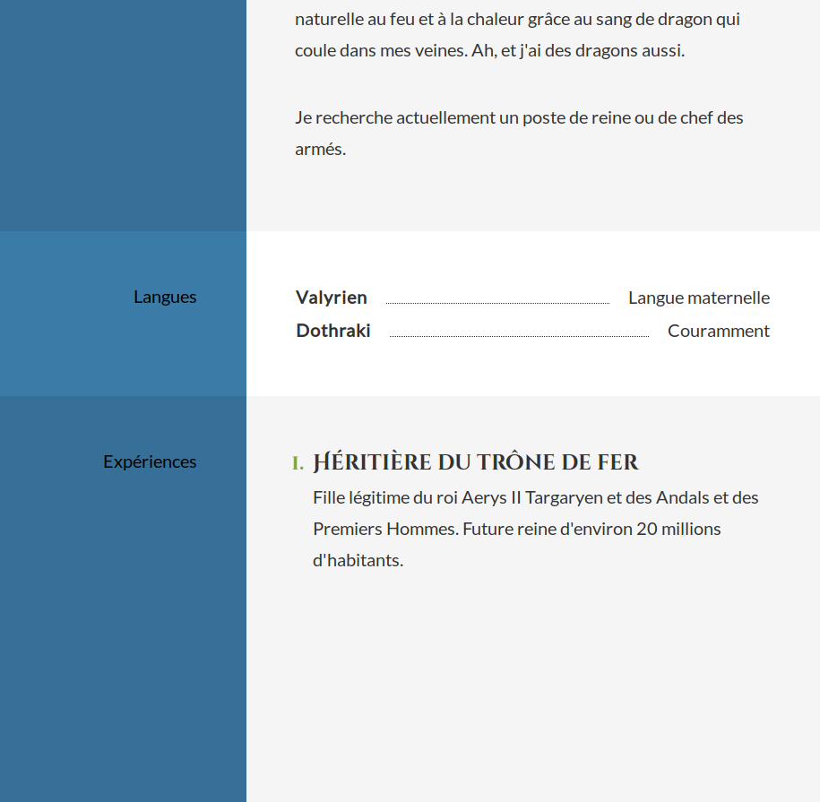

Curriculum Vitae
======

## 0. Initier son espace de travail

> Créer une page HTML vide valide

> Ajouter normalize.css

> Créer une feuille CSS vide liée à votre page HTML

> Définissez le `box-sizing` à `border-box` pour toutes les balises
 
## 1. Nom, prénom et titre

> Réaliser l'entête ci-dessous

Voici les règles pour la répartition globale de l'espace :

 - le contenu de la page est restreint à maximum 1000px et est centré
 - le contenu de la page est divisé en deux colonnes  
 - la colonne de gauche (aside) fait toujours 300px
 - la colonne de droite (main) prend la place restante, donc jusqu'à 700px
 - la colonne de gauche et la colonne de droite ont une marge interne de 50px
 - la zone à gauche du contenu doit être de la couleur de la colonne de gauche (#3B7BA7)
 - la zone à droite du contenu doit être de la couleur de la colonne de droite (blanc)
 
L'entête :
 
 - la première zone de contenu est l'entête
 - la hauteur de l'entête doit être égale à la hauteur de la fenêtre, au minimum
 - la colonne de gauche de l'entête affiche un avatar
 - la colonne de droite affiche le prénom, le nom et le titre du personnage
 - vous pouvez utiliser la google font [Cinzel Decorative](https://fonts.google.com/specimen/Cinzel+Decorative)
 - le prénom est en gras et noir
 - le nom est en black (encore plus gras) et vert (#7ba73b) en 60px
 - le titre est avec une graisse normale et en gris (#939393) en 60px
 - le contenu de l'entête est centré en hauteur en 30px, avec une marge extérieure vers le haut de 30px
 - le nom et prénom doit être un titre de niveau 1

## 2. Les informations administratives

> Ajoutez un cartouche administratif

Voici les règles à suivre :
 - le cartouche doit toujours se trouver en bas de l'entête
 - le nom doit rester centré en hauteur
 - la bordure du haut du tableau est grise (#939393)

## 3. Les motivations

> Ajoutez les sections ci-dessous

 
Voici les règles typographiques à mettre en place :

 - La police par défaut est Lato
 - La couleur d'écriture est gris foncé (#333) sauf dans la colonne de gauche où l'on écrit en noir
 - La hauteur d'interligne est 1.75
 - La taille de la police est 20px
 
Voici les règles à suivre :

 - Les fonds des sections s'alternent avec un nouveau jeu de couleurs (#367099 / #f5f5f5)
 - "Motivations" et "Langues" doivent être des titres de niveau 2
 - Le tableau des langues doit bien être un tableau 

## 4. Les expériences

> Ajoutez la section ci-dessous

Voici les règles à respecter :
 - les expériences doivent être structurées à l'aide d'une liste ordonnée
 - les expériences doivent être des titres de niveau 3
 - il ne doit pas y avoir de marges entre les titres et les descriptions des expériences
 
## 5. Gestion du responsive

> Adapter les marges internes pour garder le gabarit sur 2 colonnes jusqu'à 700px.

> Modifier le gabarit pour passer sur une colonne en-dessous de 700px.  

Pensez à :
 - Limiter la taille de l'avatar
 - Diminuer la taille du nom et prénom
 - Passer le tableau des informations administratives en vertical

 
## 6. Animation d'apparition

> Ajoutez des animations d'apparition pour les textes correspondant aux motivations, aux langues et aux expérience.

Quelques remarques :
 - La démonstration est disponible sur le PC du professeur :)
 - Le texte doit s'afficher lorsqu'il dépasse le premier tiers de l'écran
 - Pensez à vérifier que le texte en bas de page est bien lisible !

 
 
